# School District Analysis

## Overview
The city school board suspects academic dishonesty in the Thomas High School (THS)ninth graders' reading and math scores. In order to uphold state-testing standards, the district would like to compare aggregate data across the district with and without THS ninth grade reading and math scores and analyze how these grades' removal affects the overall district aggregate scores.

## Resources
- Software:
  - Python 3.10.4
    - Pandas package (to process DataFrames)
    - dataframe_image package (to save Pandas Dataframes as images)
  - Jupyter Notebook
- Data Sources:
  - clean_students_complete.csv
  - missing_grades.csv
  - schools_complete.csv
  - students_complete.csv

## Method
Analysis was run on the full, district-wide data set (details below). Then, the THS ninth-grade math and reading scores were replaced with null values (shown as 'Not a Number', or 'NaN' values), to prevent them from appearing in calculations. The analysis was run again to calculate the same metrics on the restricted data set.

### Sample of Preliminary Data Before and After THS-9th Removal
|  | Student Data | School Data |
| --- | --- | --- |
| **With THS9** | 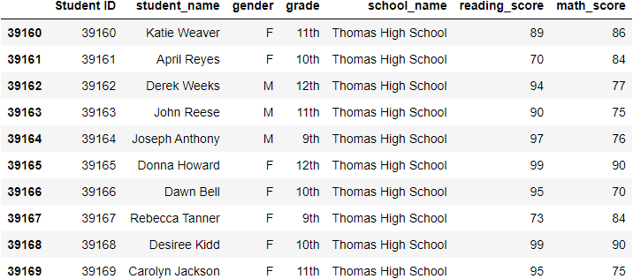 | 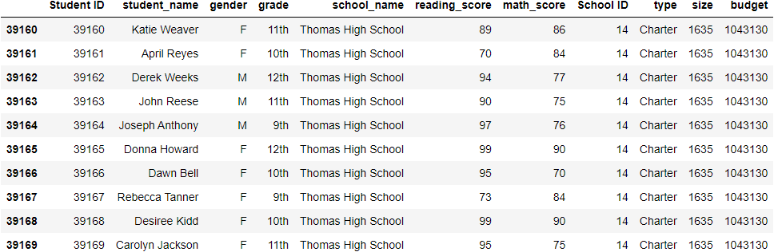 |
| **Without THS9** | 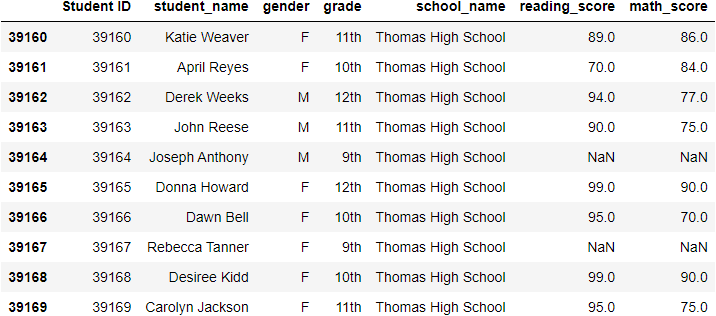 | 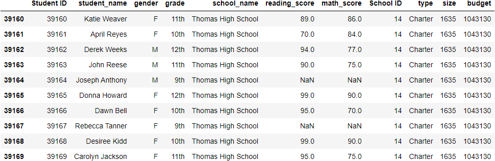 |

Note the `NaN` values in the reading and math scores for Thomas High School 9th-graders in the lower two tables.

## Analysis
We'll examine aggregate scores across the district, comparing the values both with and without Thomas High School's 9th-grade math and reading scores, and see how their omission affects the final results. We will look at the results both before and after rounding the aggregate scores.

The metrics to be analyzed are:
- District Summary
- Per-school Summary
- School Rankings, by Overall Passing Proportion, in particular:
  - Top 5 Schools in the District
  - Bottom 5 Schools in the District
- Math and Reading Scores, grouped by:
  - Grade and School
  - School Budget
  - School Size
  - School Type (District or Charter)

---
### District Summary
We see the district summary aggregate data below:

|  | Without Rounding |
| --- | --- |
| **With THS9** | 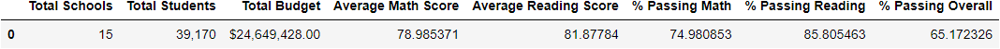 |
| **Without THS9** | 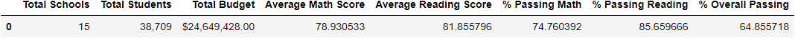 |

|  | With Rounding |
| --- | --- |
| **With THS9** | 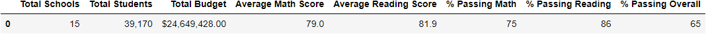 |
| **Without THS9** | 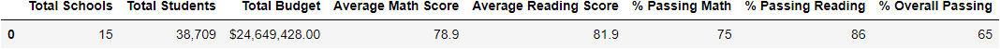 |

#### District Summary Conclusions
Upon Examination of the tables without rounding, we see that there are differences in each of the scores. However, in only one of these scores (Average Math Score) does this difference manifest itself after the aggregate scores are rounded to the specified decimal places—even then, the average score differs by only a tenth of a point.

---
### Per-School Summary
We see the per-school summary aggregate data below:

[Note that Scores were *not* rounded in the Per-School Summary.]

|  | Without Rounding |
| --- | --- |
| **With THS9** |  |
| **Without THS9** | 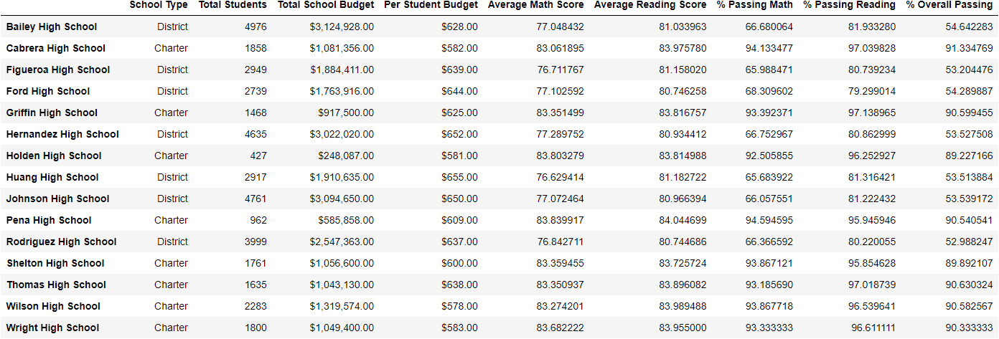 |

#### Per-School Summary Conclusions
Upon Examination of the tables, we see that there are differences in each of the Thomas High School scores. However, we also see that THS's Average Math and Average Reading scores differ by less than a tenth of a point, and each of the percentiles differ by less than 1%.

---
### School Rankings (Top 5)
We see the ranking data below:

[Note that Scores were *not* rounded in the school rankings summaries.]

|  | Without Rounding |
| --- | --- |
| **With THS9** | 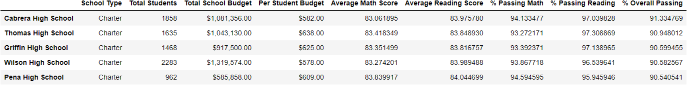 |
| **Without THS9** |  |

#### School Rankings (Top 5) Conclusions
Upon Examination of the tables, we see that there are differences in each of the Thomas High School scores. However, we also see that THS's Average Math and Average Reading scores differ by less than a tenth of a point, and each of the percentiles differ by less than 1%.

In the end, the changes caused by removing THS's 9th-grade reading and math scores did not affect the school's ranking within the district.

---
### School Rankings (Bottom 5)
We see the ranking data below:

[Note that Scores were *not* rounded in the school rankings summaries.]

|  | Without Rounding |
| --- | --- |
| **With THS9** | 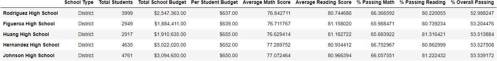 |
| **Without THS9** |  |

#### School Rankings (Bottom 5) Conclusions
Thomas High School does not appear in the bottom-five-ranked schools, and so changes in its data do not affect these results at all.

---
### Average Math Scores by School and Grade
We see the each school's average math scores by grade below:

| With THS9 | Without THS9 |
| --- | --- |
| 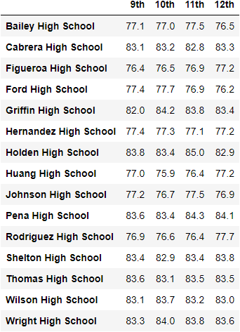 | 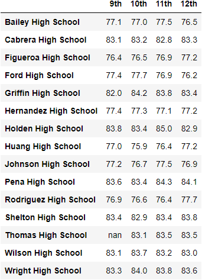 |

#### Average Math Scores by School and Grade Conclusions
As expected, the only change in these scores is in Thomas High School, 9th grade, where the scores were removed, entirely (replaced with NaNs).

---
### Average Reading Scores by School and Grade
We see the each school's average reading scores by grade below:

| With THS9 | Without THS9 |
| --- | --- |
| 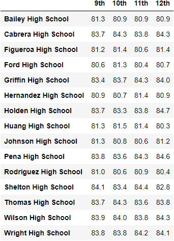 | 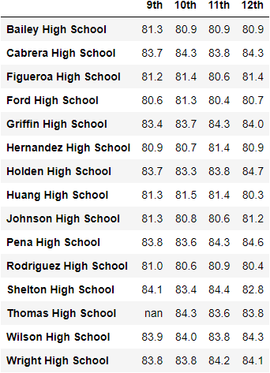 |

#### Average Math Scores by School and Grade Conclusions
As expected, the only change in these scores is in Thomas High School, 9th grade, where the scores were removed, entirely (replaced with NaNs).

---
### Scores by School Budget Summary
We see the summary aggregate data below:

|  | Without Rounding |
| --- | --- |
| **With THS9** |  |
| **Without THS9** | 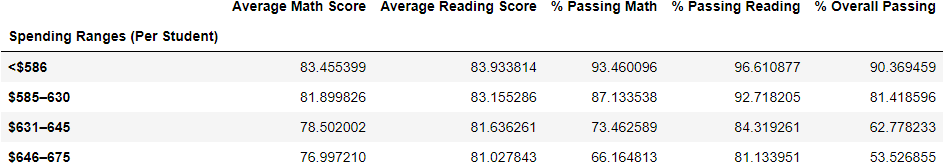 |

|  | With Rounding |
| --- | --- |
| **With THS9** | 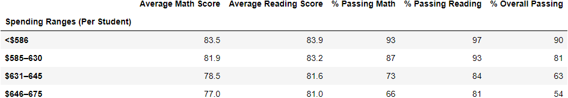 |
| **Without THS9** |  |

#### Scores by School Budget Summary Conclusions
Upon Examination of the tables without rounding, we see that there are differences in each of the scores for the row relevant to Thomas High School ($631–645). However, in each case, the differences are below the rounding threshold. As such, the rounded scores are identical in all cases.

---
### Scores by School Size Summary
We see the summary aggregate data below:

|  | Without Rounding |
| --- | --- |
| **With THS9** | 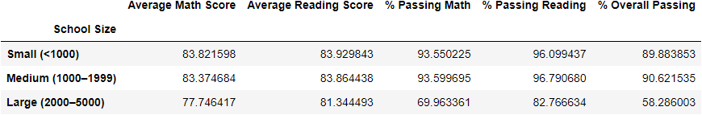 |
| **Without THS9** | 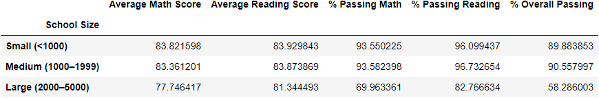 |

|  | With Rounding |
| --- | --- |
| **With THS9** | 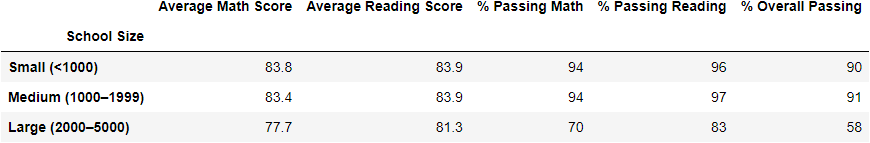 |
| **Without THS9** |  |

#### Scores by School Size Summary Conclusions
Upon Examination of the tables without rounding, we see that there are differences in each of the scores for the row relevant to Thomas High School (Medium (1000–1999)). However, in each case, the differences are below the rounding threshold. As such, the rounded scores are identical in all cases.

---
### Scores by School Type Summary
We see the summary aggregate data below:

|  | Without Rounding |
| --- | --- |
| **With THS9** | 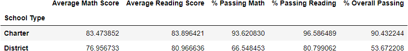 |
| **Without THS9** | 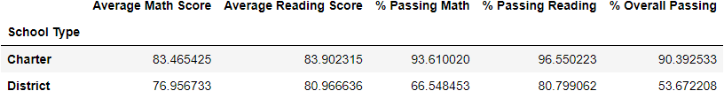 |

|  | With Rounding |
| --- | --- |
| **With THS9** | 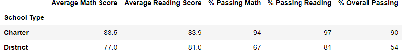 |
| **Without THS9** |  |

#### Scores by School Type Summary Conclusions
Upon Examination of the tables without rounding, we see that there are differences in each of the scores for the row relevant to Thomas High School (Charter). However, in each case, the differences are below the rounding threshold. As such, the rounded scores are identical in all cases.

## Summary
As expected, the removal of Thomas High School's 9th-grade reading and math scores *does* have an effect on the aggregate scores, but only if we examine the data to a very high degree of precision. Once the aggregate scores are rounded, however, we find very little change in the scores across the district.

In particular, we find that the following scores show a difference[^1], pre-rounding, in each summary in which they appear:
  - Average Math Score
  - Average Reading Score
  - % Passing Math
  - % Passing Reading
  - % Overall Passing

[^1]: For scores that are broken down by school, changes only appear where relevant to Thomas High School.

In the breakdowns of math and reading scores by school and grade, we also see only the expected change in Thomas High School's 9th grade scores.

Once the summary scores are rounded, however, the *only* place in which we see a change is in the District Summary, where the **Average Math Score** goes from **79.0** *with* Thomas High School's 9th graders included to **78.9** *without* Thomas High School's 9th graders. (**Total Students** also drops from **39,170** to **38,709**, due to the removal of the THS 9th graders.)

## Conclusion
Thomas High School's 9th-grade math and reading scores do not have a significant effect on the city's overall district metrics.